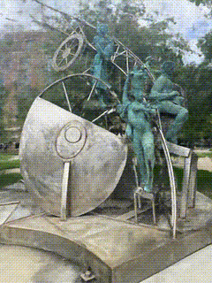
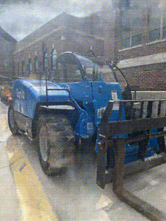
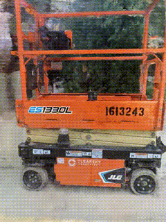
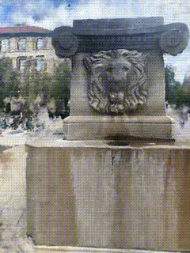

# Neural Radiance Fields for Novel View Generation
I wanted to learn about NeRF and this repo is my attempt at that. I will be giving a informal narrative of how I understood nerf and carried out a few experiments to test out the model's capability.

# Understanding Nerf and useful resources

## COLMAP

---

# Experiments
I collected images for four different object scenes across Purdue University's campus. Here are the output gifs of novel view synthesised by NERF

## Sculpture

## Forklift

## Scissor Lift

## Lion Fountain

---

# Citations
- NeRF paper [Mildenhall, Ben, et al. "Nerf: Representing scenes as neural radiance fields for view synthesis." Communications of the ACM 65.1 (2021): 99-106.](https://arxiv.org/abs/2003.08934)
- nerf-pytorch [Yen-Chen, Lin "NeRF-pytorch"](https://github.com/yenchenlin/nerf-pytorch/)
